# SQL
## My SQl journey
### 
# Introduction
## SQL (Structured Query Language) is a type of language used for managing relational databases.

A database is a structured collection of data that is organized and stored in a way that allows efficient retrieval, management, and manipulation of information.

## Types of databases
Relational database is a type of database that organizes data into rows and columns hence the name ‘relational’.
Non-relational database (NoSQL) stores data in any format other than the relational (rows and columns) format. 

# Working on Relational database
## Lets Jump into the world of SQL
# Creating a Database
## Using SQL syntax Student_record
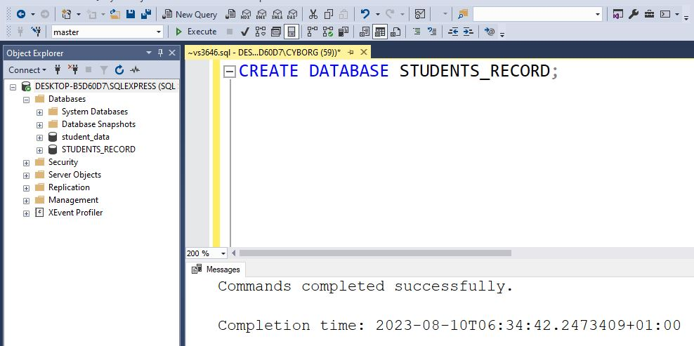

- Use Database Student_record
 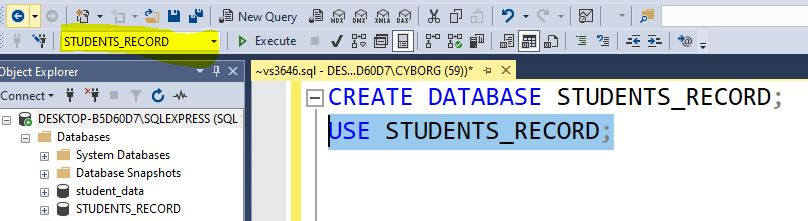

- ## Creating Table Student_info, Health_record and Performance.

 

 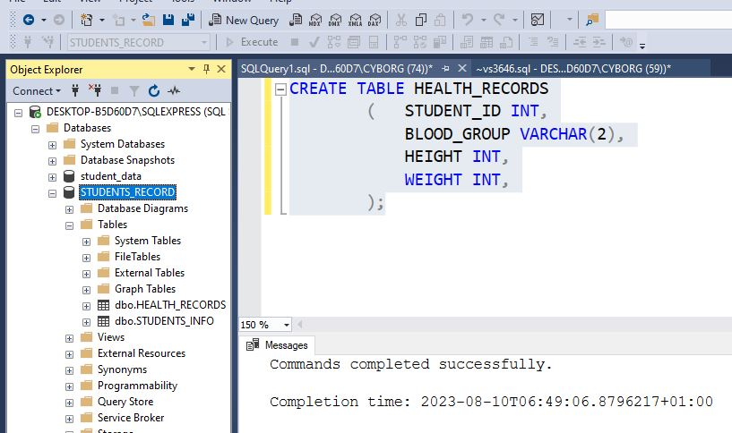

 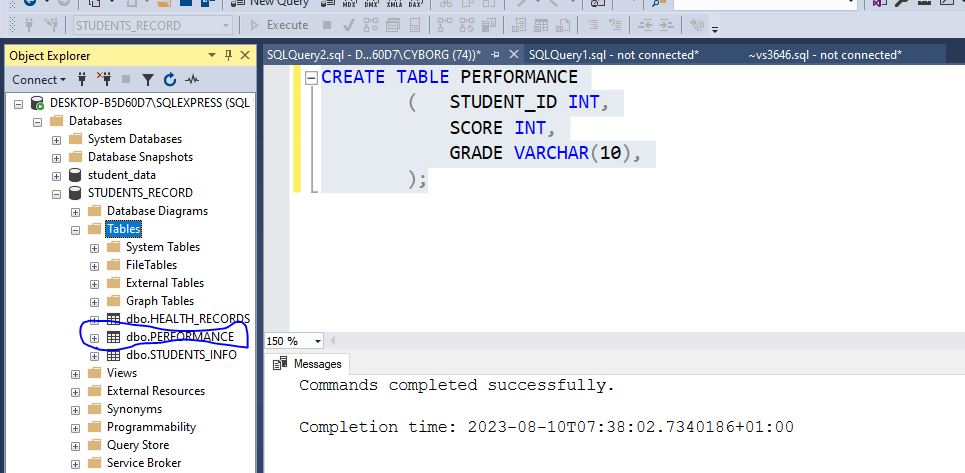

 - ## Inserting into the created tables
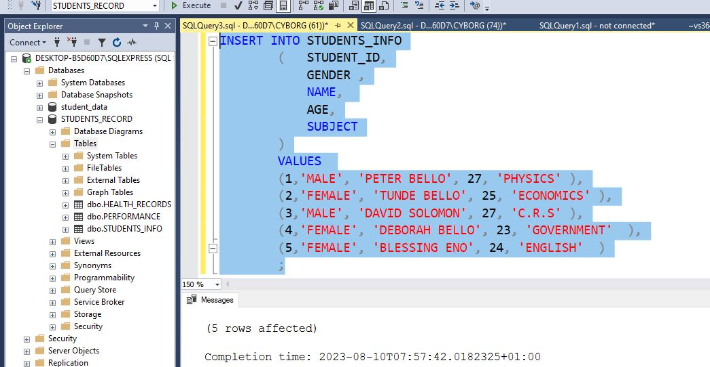
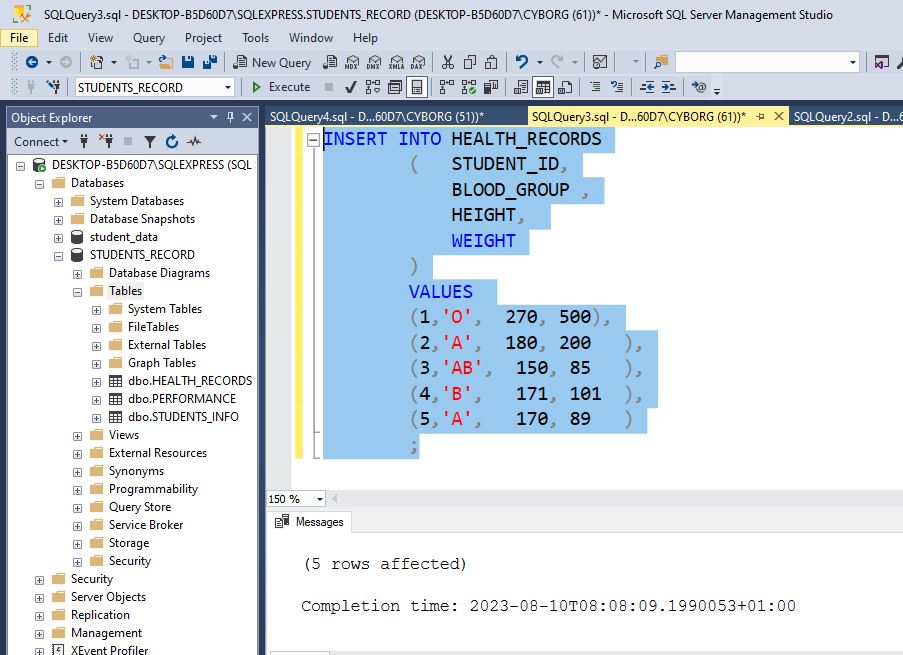
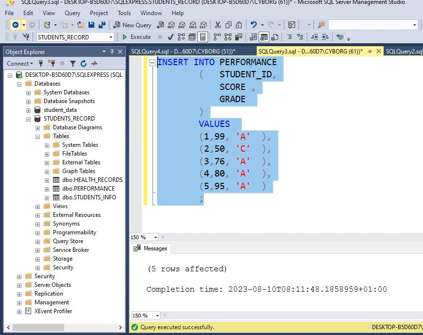

- ## Veiw records inserted using SQL codes
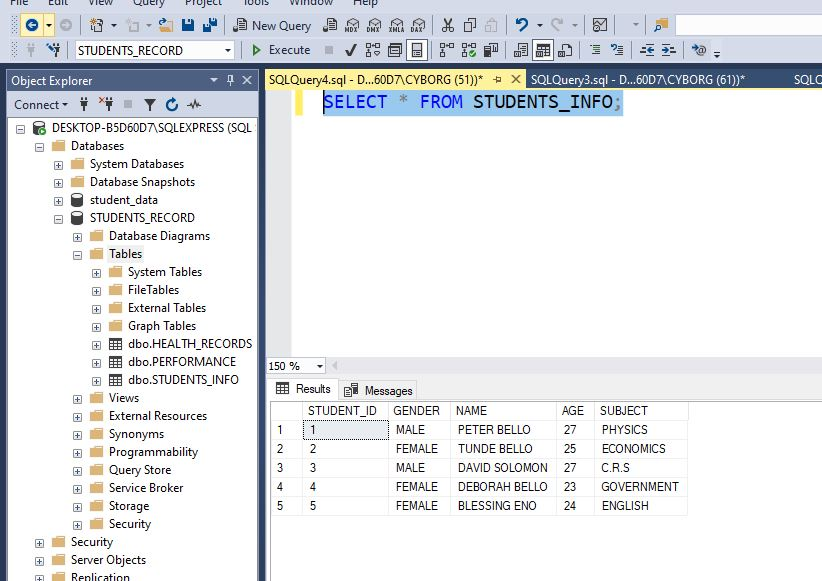
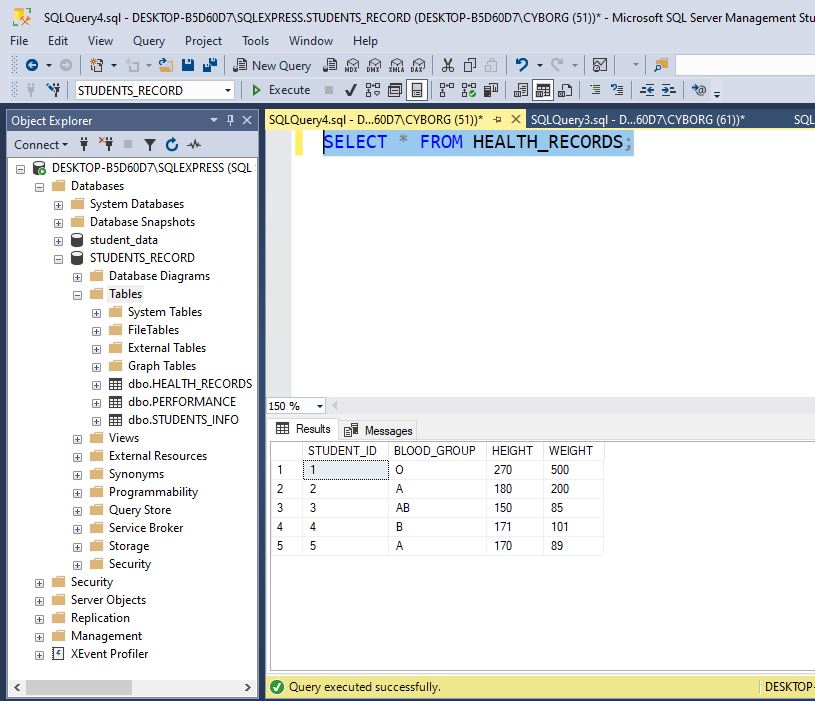
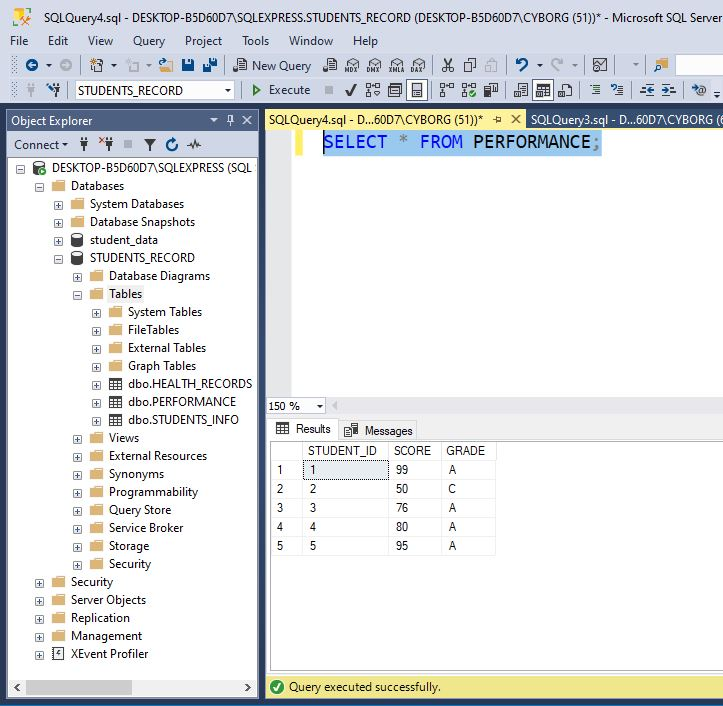

- ## Making Student_id Primary 🔐
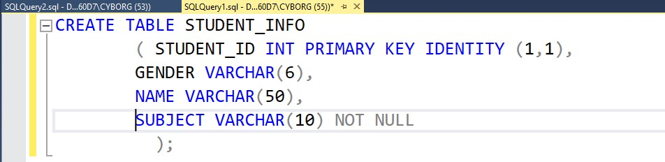

- ## Drop column age in Student_info
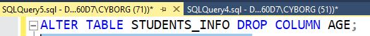

## End of Task One
